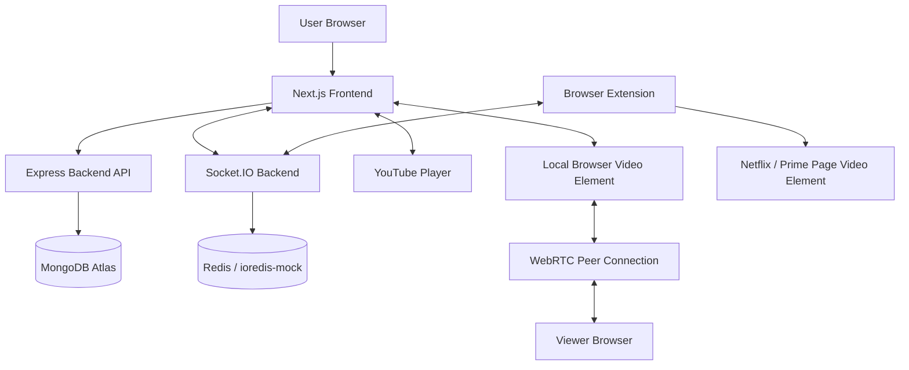
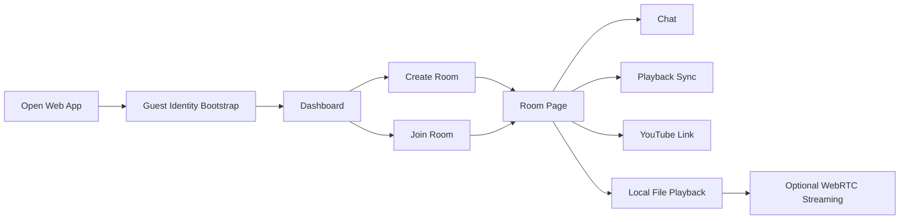
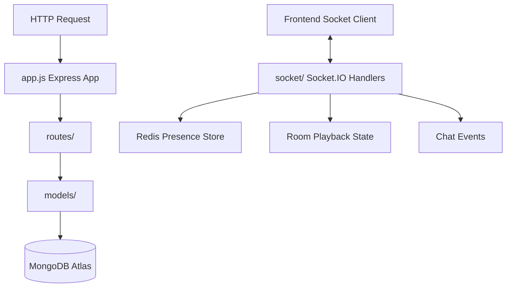
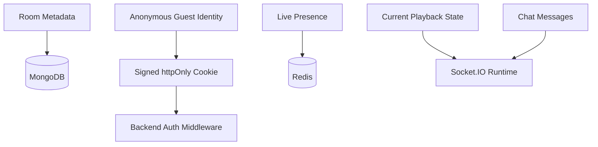
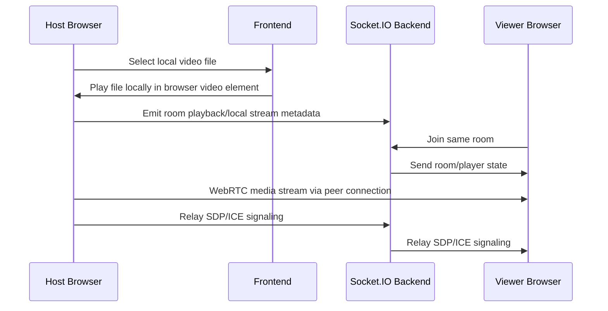
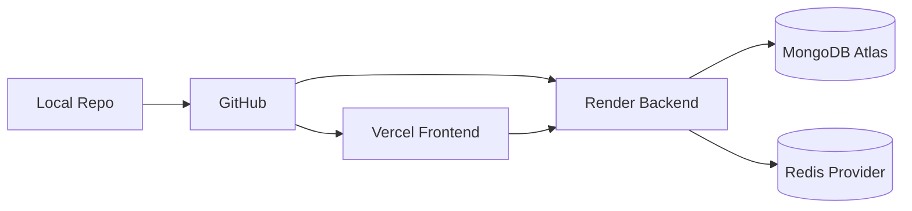

# WatchParty Repo Graph

This file gives Codex/AI tools a fast map of the project so they do not need to rediscover the repo structure every time.

Repository: `5uhaeb/watchparty`

## 1. Project Summary

WatchParty is a full-stack watch-party application with:

- Next.js frontend
- Express + Socket.IO backend
- MongoDB Atlas for persistent room/user data
- Redis or `ioredis-mock` for transient live presence
- Anonymous guest identity using signed httpOnly cookies
- Room creation and joining
- Chat
- Basic playback synchronization
- YouTube link support
- Local file metadata sync
- Local file WebRTC streaming from host browser to viewers
- Browser extension for Netflix/Prime sync control only

Important limitation: Netflix, Prime Video, Hotstar, and other protected OTT platforms are sync-only. The app should not capture, download, bypass DRM, or rebroadcast protected video streams.

## 2. Top-Level Repo Structure

```txt
watchparty/
├── .github/
│   └── workflows/
├── backend/
│   ├── src/
│   │   ├── config/
│   │   ├── lib/
│   │   ├── models/
│   │   ├── routes/
│   │   ├── socket/
│   │   ├── app.js
│   │   └── server.js
│   ├── .env.example
│   ├── package.json
│   └── package-lock.json
├── docs/
│   ├── SERVING_VIDEO_FILES.md
│   ├── VIDEO_FORMAT_GUIDE.md
│   ├── identity.md
│   └── video-formats.md
├── extension/
│   ├── icons/
│   ├── vendor/
│   ├── README.md
│   ├── background.js
│   ├── background.ts
│   ├── content-netflix.js
│   ├── content-netflix.ts
│   ├── content-prime.js
│   ├── content-prime.ts
│   ├── manifest.json
│   ├── popup.html
│   ├── popup.js
│   └── popup.ts
├── frontend/
│   └── src/
│       ├── app/
│       ├── components/
│       ├── lib/
│       ├── players/
│       └── styles/
├── tests/
│   └── e2e/
├── .gitignore
├── README.md
├── package.json
├── package-lock.json
├── playwright.config.ts
└── render.yaml
```

## 3. Main Runtime Architecture



## 4. Frontend Responsibilities

Likely location: `frontend/src/`

The frontend owns:

- App routes and pages under `frontend/src/app/`
- UI components under `frontend/src/components/`
- Client utilities under `frontend/src/lib/`
- Player adapters under `frontend/src/players/`
- Styling under `frontend/src/styles/`
- Reading public env vars:
  - `NEXT_PUBLIC_API_URL`
  - `NEXT_PUBLIC_SOCKET_URL`
  - `NEXT_PUBLIC_STUN_URLS`
  - `NEXT_PUBLIC_TURN_URL`
  - `NEXT_PUBLIC_TURN_USER`
  - `NEXT_PUBLIC_TURN_CRED`

Frontend user flow:



## 5. Backend Responsibilities

Likely location: `backend/src/`

The backend owns:

- Express app setup in `backend/src/app.js`
- Server bootstrap in `backend/src/server.js`
- Database/Redis configuration under `backend/src/config/`
- Reusable helpers under `backend/src/lib/`
- MongoDB/Mongoose models under `backend/src/models/`
- HTTP API routes under `backend/src/routes/`
- Socket.IO room/chat/playback/presence logic under `backend/src/socket/`

Backend env vars:

```env
PORT=5000
CLIENT_URL=http://localhost:3000
MONGODB_URI=your_mongodb_atlas_uri
REDIS_URL=redis://localhost:6379
GUEST_JWT_SECRET=replace_me
EXTENSION_TOKEN_SECRET=replace_me
EXTENSION_INTERNAL_SECRET=replace_me
```

Backend flow:



## 6. Realtime Socket Responsibilities

Socket.IO should handle:

- User joins a room
- User leaves a room
- Reconnect grace window
- Presence updates
- Chat messages
- Playback state updates
- Host/local file WebRTC signaling
- Extension-driven OTT sync events

Suggested event categories:

```txt
room:join
room:leave
presence:update
chat:message
playback:state
playback:seek
playback:play
playback:pause
webrtc:offer
webrtc:answer
webrtc:ice-candidate
extension:sync
extension:token
```

Actual event names may differ. Before changing socket code, inspect `backend/src/socket/` and matching frontend socket calls.

## 7. Data / Persistence Graph



Persistence rule:

- MongoDB = durable data such as rooms and app records.
- Redis = live/transient presence only.
- Socket runtime = realtime sync state.
- Browser cookie = guest identity session.

## 8. Local File Streaming Flow



Key rule: local media bytes are not uploaded to the backend. The backend only relays signaling and metadata.

## Watch Party Audio Architecture

```txt
Media Audio + Mic Audio
        ↓
Web Audio API Mixer
        ↓
Single Mixed Audio Track
        ↓
WebRTC Peer Connection
        ↓
Remote Participants
```

The frontend audio mixer lives in `frontend/src/lib/audioMixer.ts`. It captures microphone audio with browser echo cancellation, noise suppression, and auto gain control enabled by default. When the active watch media is an HTML media element that supports `captureStream()`, the mixer also captures movie audio and combines both sources through `AudioContext`, `GainNode`, and `createMediaStreamDestination()`.

This avoids separating movie audio and call audio in the outgoing WebRTC path while still allowing independent mic, media, and remote-participant volume balancing. Optional voice priority does not mute the movie; it ducks media volume slightly while local speech is detected, then restores it after speech stops.

Browser limitation: YouTube iframes and protected OTT pages cannot be captured by this app. If `HTMLMediaElement.captureStream()` is unavailable or media audio cannot be captured, the UI shows a friendly warning and the voice call continues normally.

## 9. OTT Browser Extension Graph

Location: `extension/`

Purpose:

- Sync playback position for Netflix and Prime Video pages.
- Observe/control the existing page `<video>` element.
- Communicate with WatchParty Socket.IO backend.
- Use short-lived extension tokens from the web app/backend.

Files:

```txt
extension/
├── manifest.json              # Chrome MV3 manifest
├── background.ts/js           # Service worker + Socket.IO connection
├── content-netflix.ts/js      # Netflix video adapter
├── content-prime.ts/js        # Prime Video video adapter
├── popup.html                 # Extension popup UI
├── popup.ts/js                # Popup logic
├── vendor/socket.io.min.js    # Vendored Socket.IO client
└── icons/                     # Extension icons
```

Extension safety boundary:

```txt
Allowed:
- read current video time
- detect play/pause
- seek the local page video element
- sync state across users who have opened the same title themselves

Not allowed:
- bypass DRM
- download OTT video
- capture encrypted media
- rebroadcast Netflix/Prime/Hotstar content
```

## 10. Deployment Graph



Deployment notes:

- Deploy `frontend/` to Vercel.
- Deploy `backend/` to Render.
- `render.yaml` likely controls Render backend deployment.
- Frontend env must point to backend URL.
- Backend `CLIENT_URL` / CORS must allow frontend URL.

## 11. Local Development Commands

From repo root:

```bash
# install root deps if needed
npm install
```

Backend:

```bash
cd backend
npm install
cp .env.example .env
npm run dev
```

Frontend:

```bash
cd frontend
npm install
cp .env.example .env.local
npm run dev
```

Extension:

```txt
1. Open chrome://extensions or edge://extensions
2. Enable Developer mode
3. Click Load unpacked
4. Select the repo's extension/ folder
```

## 12. Environment Variable Map

Frontend `.env.local`:

```env
NEXT_PUBLIC_API_URL=http://localhost:5000/api
NEXT_PUBLIC_SOCKET_URL=http://localhost:5000
NEXT_PUBLIC_STUN_URLS=stun:stun.l.google.com:19302
NEXT_PUBLIC_TURN_URL=
NEXT_PUBLIC_TURN_USER=
NEXT_PUBLIC_TURN_CRED=
```

Backend `.env`:

```env
PORT=5000
CLIENT_URL=http://localhost:3000
MONGODB_URI=your_mongodb_atlas_uri
REDIS_URL=redis://localhost:6379
GUEST_JWT_SECRET=replace_me
EXTENSION_TOKEN_SECRET=replace_me
EXTENSION_INTERNAL_SECRET=replace_me
```

## 13. Important Rules for Future Codex/AI Work

Before editing:

1. Inspect the exact file before changing it.
2. Do not rename socket events without updating both frontend and backend.
3. Do not introduce protected-stream capture or DRM bypass logic.
4. Keep local file streaming WebRTC-based; do not upload video bytes to backend.
5. Keep Redis presence transient.
6. Keep guest identity cookie signed and httpOnly.
7. Keep frontend/backend env var names consistent with README.
8. If adding OTT support, add a content adapter only for controlling the local page video element.

## 14. Common Fix Areas

Use this map when debugging:

```txt
Frontend broken page/navigation:
  frontend/src/app/
  frontend/src/components/

Socket not connecting:
  frontend env NEXT_PUBLIC_SOCKET_URL
  backend CLIENT_URL / CORS
  backend/src/socket/

API failing:
  frontend env NEXT_PUBLIC_API_URL
  backend/src/routes/
  backend/src/app.js

Rooms not saving:
  backend/src/models/
  backend MongoDB connection config
  MONGODB_URI

Presence/reconnect issue:
  backend/src/socket/
  Redis config
  REDIS_URL

Local file streaming issue:
  frontend/src/players/
  WebRTC signaling events
  NEXT_PUBLIC_STUN_URLS / TURN vars

Netflix/Prime extension issue:
  extension/content-netflix.ts/js
  extension/content-prime.ts/js
  extension/background.ts/js
  extension/popup.ts/js
  EXTENSION_TOKEN_SECRET
  EXTENSION_INTERNAL_SECRET
```

## 15. Recommended Next Improvements

- Host-only playback controls
- Persistent chat storage
- YouTube iframe sync adapter hardening
- Better room permissions
- Optional user accounts
- TURN server setup for reliable cross-network WebRTC
- E2E tests for room creation, join, chat, and playback sync
- Extension token refresh flow
- Better deployment documentation for Vercel + Render
